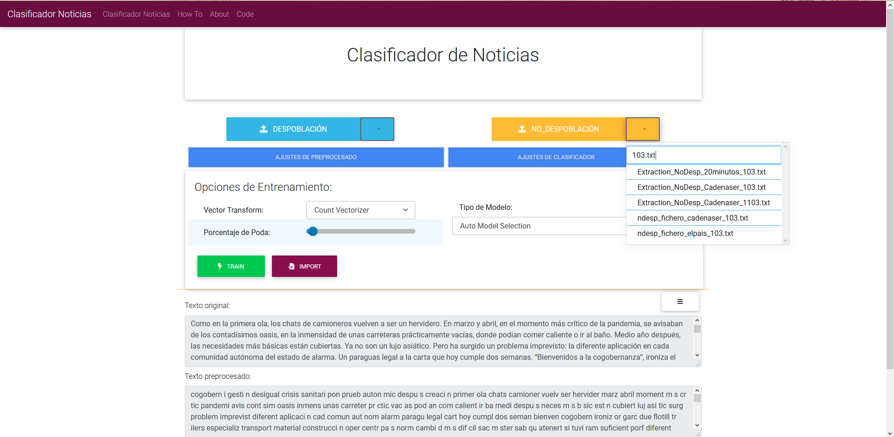
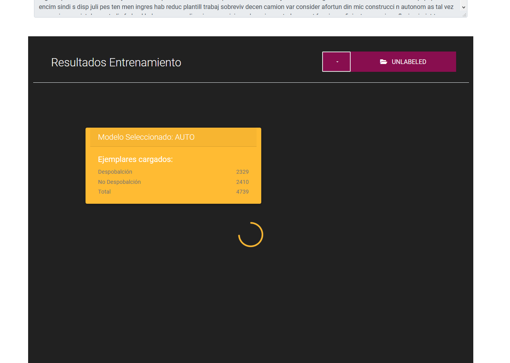
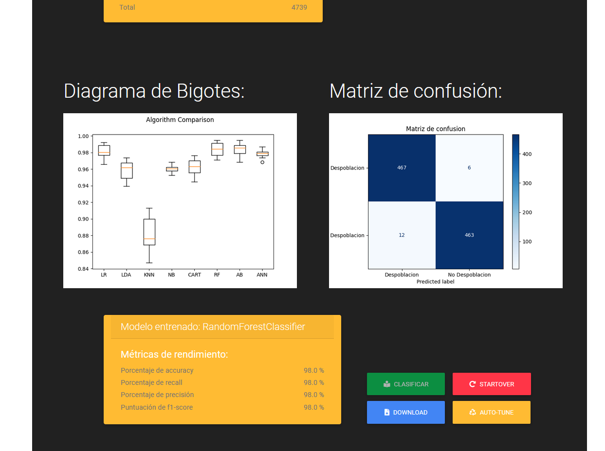
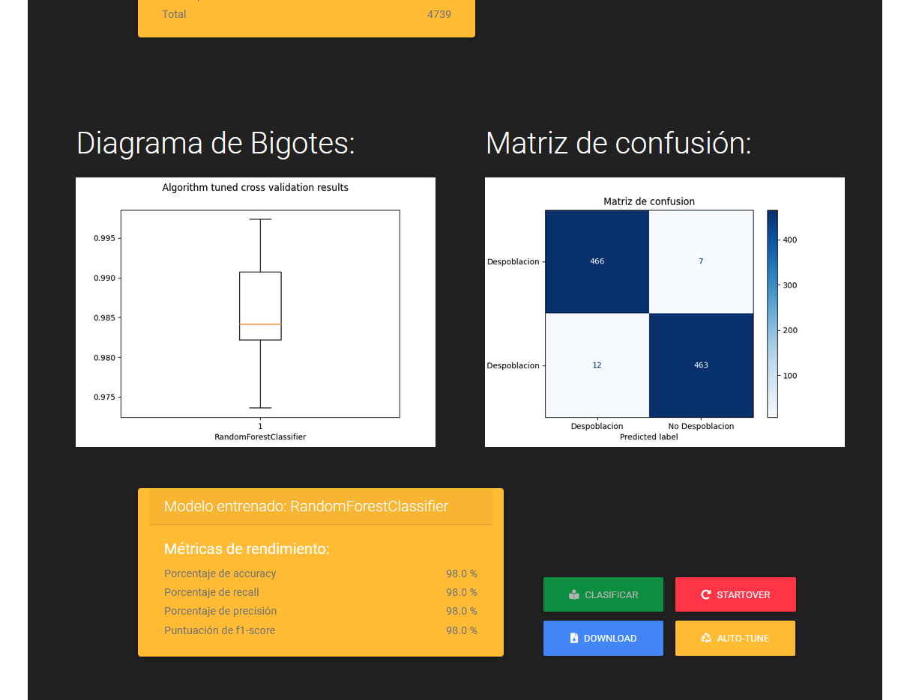
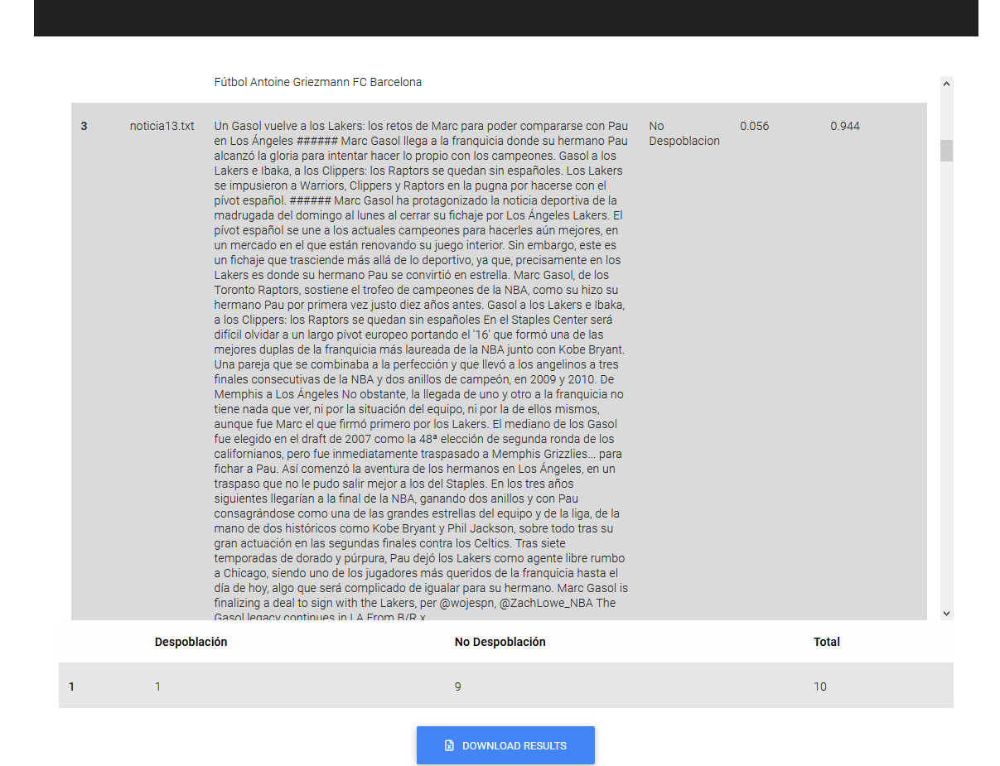

# text-classifer
A FlaskApp for article classificator training using nltk and sklearn.
--------------------------------------------------------------------

## Usage:
```bash
  git clone https://github.com/RoachLok/text-classifer/
  python app.py
```
Local server is launched on port 5000 by default.


--------------------------------------------------------------------

## Gallery:

<p align="center">
  
</p>

<p align="center">
  
</p>

<p align="center">
  
</p>

<p align="center">
  
</p>

<p align="center">
  
</p>

--------------------------------------------------------------------

### TODO

* Make train metrics panel pretier.
* Code and directory re-organization.
